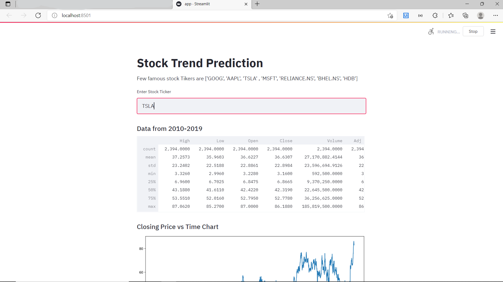
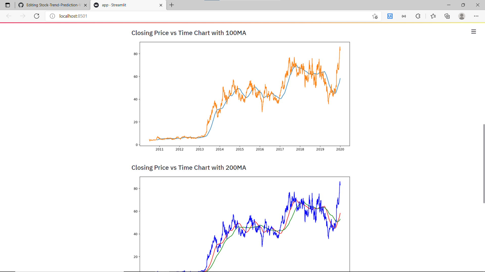
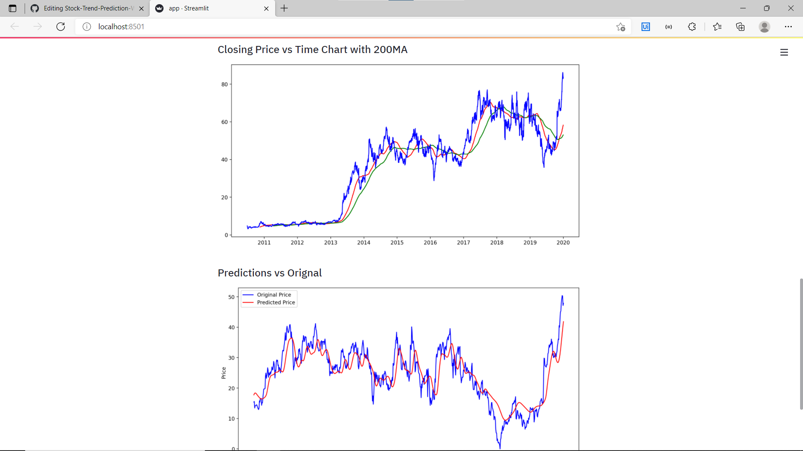
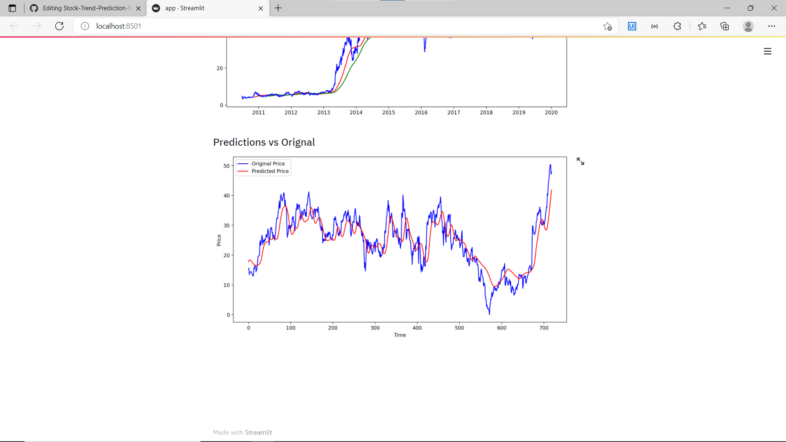

# Stock-Trend-Prediction-Web-App
In these project I created stock trend web application to predicted continuous real time trend of desired stock input taken from user with fetching data from "Yahoo Finance".

•Mean average of 100,200 days for better prediction and divided train & test data into 70:30 ratio and predicted with depriciating loss of 0.0033.  

•You can predict the stock trend by These Web app by just entering stock tiker of company.

This web app is made using -

•Streamlit,

•Tensorflow models/layers,

•keras,

•LSTM sequential model which is powerful for time series prediction,

•Data fetched from yahoo finance using pandas_datareader function,

•Numpy,Pandas and matplotlib.pyplot were used in these model creation,

•Used mean squared root loss,adam optimizer,

•Saved module named 'keras.model.h5' and used in app.py for final output,

⁕**Visualisation**

⁕**100 mean average graph**

⁕**200 mean average graph**

⁕**Original VS Prediction graph**

•made final output visualisation for comparision of original VS predicted graph.

*you can access these web app by typing  (streamlit run app.py) in comand prompt.
